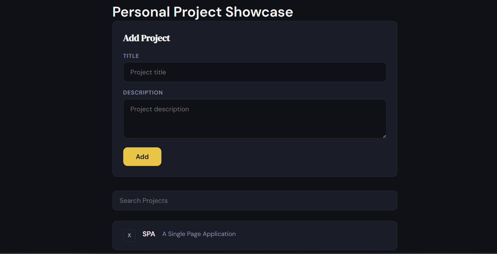

# Project Showcase

A personal project showcase Single Page Application (SPA) built with React and Vite. Users can add, search, and delete projects dynamically without any page reloads.

## Screenshot



## Live Demo

[View Live App](https://omandavid.github.io/project-showcase/)

## Features

- Add new projects with a title and description
- Delete projects with a single click
- Search/filter projects in real time
- Responsive design that works on mobile and desktop
- Dark editorial theme with yellow accent

## Component Structure

## State Management

- `projects` — array of project objects, managed in `App`
- `searchTerm` — string for filtering projects, managed in `App`
- `ProjectForm` manages its own local input state via `useState`

## Setup and Installation

1. Clone the repository:
```bash
git clone https://github.com/OmanDavid/project-showcase.git
cd project-showcase
```

2. Install dependencies:
```bash
npm install
```

3. Start the development server:
```bash
npm run dev
```

4. Open your browser at `http://localhost:5173`

## Running Tests

```bash
npm test
```

Tests are written with Vitest and React Testing Library. The following components are covered:

- `Header` — renders the app title
- `ProjectCard` — renders project details and handles delete
- `ProjectForm` — handles input, submission, and empty title guard
- `ProjectList` — renders projects and shows empty state message

## Known Limitations

- Projects are not persisted — refreshing the page resets the list to seed data
- Image support is not included in this version
- No backend or database integration

## Tech Stack

- React 19
- Vite
- Vitest
- React Testing Library